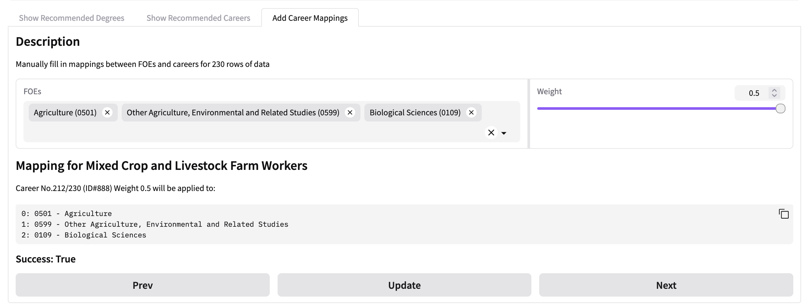

<!-- vscode-markdown-toc -->
<!-- vscode-markdown-toc-config
	numbering=false
	autoSave=true
	/vscode-markdown-toc-config -->
<!-- /vscode-markdown-toc -->

# README

This README outlines the context for the project, links to project
documentation, as well as how to run and use the program.

**Table of Contents**

- [README](#markdown-header-readme)
- [README](#markdown-header-readme-1)
  - [Project Context](#markdown-header-project-context)
  - [Documentation](#markdown-header-documentation)
    - [Meeting Minutes](#markdown-header-meeting-minutes)
    - [Research and Summaries](#markdown-header-research-and-summaries)
  - [Design Decisions](#markdown-header-design-decisions)
    - [Use of Narrow Fields Of Education (FOE)](#markdown-header-use-of-narrow-fields-of-education-foe)
    - [Official Data](#markdown-header-official-data)
    - [Web-scraping](#markdown-header-web-scraping)
  - [Functionalities](#markdown-header-functionalities)
    - [Recommend Degrees Based on Fields of Education](#markdown-header-recommend-degrees-based-on-fields-of-education)
    - [Filtering](#markdown-header-filtering)
    - [Career Recommendations](#markdown-header-career-recommendations)
      - [Career Recommendation Algorithm](#markdown-header-career-recommendation-algorithm)
      - [Algorithm Data](#markdown-header-algorithm-data)
    - [Adding Career Mappings](#markdown-header-adding-career-mappings)
    - [Out of scope](#markdown-header-out-of-scope)
      - [Alternate Entry](#markdown-header-alternate-entry)
      - [Non-accredited course](#markdown-header-non-accredited-course)
      - [Direct entry jobs/careers](#markdown-header-direct-entry-jobscareers)
  - [Testing](#markdown-header-testing)
    - [Running tests](#markdown-header-running-tests)
    - [Automatic Testing](#markdown-header-automatic-testing)
  - [Using this Repository](#markdown-header-using-this-repository)
    - [Setting up](#markdown-header-setting-up)
    - [Running the application](#markdown-header-running-the-application)
    - [Using the UI](#markdown-header-using-the-ui)
    - [Scripts](#markdown-header-scripts)
  - [Deployment](#markdown-header-deployment)
  - [Resources](#markdown-header-resources)
  - [OTHERS](#markdown-header-others)

# README

This README outlines the context for the project, links to project
documentation, as well as how to run and use the program/

## Project Context

In partnership with OIC Education, this project creates an algorithm matching
suitable career fields to individuals based on their personality, education, and
family.

## Documentation

### Meeting Minutes

Weekly Meetings occur at the following times

- Thursday 8am-10am
  - Tutor Check-in
  - Group Meeting
- Tuesday 7:30pm-8:30pm
- Client Meeting (as needed)

A list of all meeting minutes is
[located on Confluence](https://comp3888-th08-01.atlassian.net/wiki/spaces/C/pages/edit-v2/229472#Meeting-Minutes).
These include

- [Group and Tutor Meetings](https://comp3888-th08-01.atlassian.net/wiki/x/FQAS)
- [Client Meetings](https://comp3888-th08-01.atlassian.net/wiki/x/I4AT)

### Research and Summaries

- [XP Summary](https://comp3888-th08-01.atlassian.net/wiki/spaces/C/pages/1376271/XP+Summary)
- [Project Scope Statement / Plan](https://comp3888-th08-01.atlassian.net/wiki/x/AYAG)

## Design Decisions

### Use of Narrow Fields Of Education (FOE)

We chose to focus on using narrow FOEs (the 4-digit codes) because the broad
FOEs provided little value in terms of recommending specific degrees. On the
other hand, using detailed FOEs narrowed the choice in degrees so much that it
did not allow us to offer a sufficient breadth of options for some FOEs. One
point of improvement, and where we have begun to experiment - is using the
detailed code for some courses such as dentistry in which it makes sense to have
less variation in course recommendations.

### Official Data

A lot of the statistics about courses and job growth were accessible in
well-formatted data. We then cleaned and uploaded this to our database. For
example, all the courses and their associated FOEs were in one file.

A detailed description of the data sources can be found in
[`documentation/data.md`](/documentation/data.md)

### Web-scraping

In contrast, career information was not easily accessible. Therefore, we
web-scraped the job-listing sites: Indeed, Workforce Australia, and SEEK to get
information about salaries and which degrees link to which career paths.

Details about web-scraping are documented in
[`documentation/web_scraping.md`](documentation/web_scraping.md).

## Functionalities

### Recommend Degrees Based on Fields of Education

We have created a database which links fields of education with degrees across
Australian universities. This can be seen in the courses table of
`oic_careers.db`. This can be accessed using SQL or via our UI. The UI takes as
an input a JSON of FOE codes. The outputted degrees can be sorted and filter
with various values. This function can be seen in the `display_degrees.py` file.
The UI is located in the `app.py` file.

Details on the algorithm, how it works, and why particular design choices were
made can be found in
[`documentation/degree_recommendation.md`](documentation/degree_recommendation.md)

### Filtering

The degrees displayed can be filtered by the ranking of the universities: there
is an option to only display degrees from the top 3/5/7 universities. In
addition, we have added the ability to filter by budget. Finally, we have
implemented functionality to take into account a user's ATAR, showing degrees
which are aspirational, likely and guaranteed for the student to get into.

### Career Recommendations

We extend the program to also recommend career paths for each FOE. For each
career, we provide useful information such as job growth statistics and whether
there is currently a shortage of workers in that field. We then added a slider
for randomness. More random results are still related but not so standard career
paths. This allows a student to ideate on potential career paths - widening
their possibilities.

#### Career Recommendation Algorithm

Details on the algorithm, how it works, and why particular design choices were
made can be found in
[`documentation/career_recommendation.md`](documentation/career_recommendation.md)

#### Algorithm Data

The data for this algorithm originates from the Official Data and Web-scraped
data. Documentation on how the data was cleaned and merged can be found in
[`documentation/career_cleaning.md`](documentation/career_cleaning.md).

### Adding Career Mappings

In addition to the mappings created as described above, we want the admin to be
able to map different careers to FOE codes manually. This has been implemented
as a separate tab on the UI.



This feature will display a list of careers that the user can navigate by
clicking the "Prev" and "Next" buttons. For each career, the name and ID are
displayed for reference.

A flow for a single career is as follows:

1. Select any number of FOEs related to the career from the dropdown.
2. Select a weight between 0 and 0.5 that will apply to **all** FOEs.
   - `0` means not related at all
   - `0.25` means somewhat relevant, like FOE 0109 "Biological Sciences" to the
     career "Anaesthesiologist".
   - `0.5` means highly relevant, like FOE 0501 "Agriculture" to the career
     "Crop Farmer".
3. Click the "Update" button to insert the new weightings into the database.
4. Repeat 1-3 for additional FOEs at different weightings.

### Out of scope

#### Alternate Entry

We have not included alternative pathways into universities besides ATAR.

#### Non-accredited course

We are focusing on accredited university courses for career recommendations as
it creates a more realistic scope and seems to be aligned with customer wants.

#### Direct entry jobs/careers

Some professional careers such as software engineering may not require a
university degree to enter. However, we have not added this possibility, again
to limit the scope and also because it is much harder to qualify the
requirements for those career paths.

## Testing

### Running tests

Automated tests for this package are located in the `tests` directory. They can
be run with`make test` on a Unix/Linus OS. Otherwise, you can use
`python3 -m unittest`.

We have unit tests to check our SQL queries and our algorithm which are found
under [`test/unit_tests`](test/unit_tests/). Full documentation for testing can
be found at [`test/tests.md`](test/tests.md)

### Automatic Testing

Tests and coverage results can be run using the following commands:

```bash
python3 -m coverage run -m unittest
python3 -m coverage html
```

A list of tests and their purpose is located in
[`test/tests.md`](test/tests.md).

## Using this Repository

To use this repository, you will need `python3` and `pip3`.

Details on how to use this repo will be added as it is updated.

### Setting up

Before running any code, first ensure that you have all necessary modules
installed in a virtual environment by running `pip3 install -r requirements.txt`
in the project directory.

The main functionalities of the project are found in the `application` folder.

### Running the application

To run the application use `python -m application.app`.

### Using the UI

Upload a JSON file containing field of education names and codes. It should be
in the form:

```
{
    "inputs": [
        {
            "code": "0603",
            "name": "Nursing"
        },
        {
            "code": "0201",
            "name": "Computer Science"
        },
        {
            "code": "0811",
            "name": "Banking, Finance and Related Fields"
        }
    ],
    student_id = 1
}
```

The application will then display a list of relevant degrees for each FOE.

### Scripts

There are several scripts written (and to be written) for this project. They can
be run from the `scripts` directory and invoking `python3 <script_name>` from
the terminal.

- `datagov_script.py`: This script extracts the cleaned datasets from
  datagov_cleaned folder and inserts them into `data` (`oic_careers.db`)
- `foe_script.py`: This script extracts 4 digit `Field of Education` codes (from
  an .xlsx file) and inserts them into `data` (`oic_careers.db`)
- `indeed_data_scraper.py`: This script populates `data/oic_careers.db` with job
  data from Indeed (currently filled with jobs posted as of 25/08/2024), with
  possible duplicates
- `initialize_db.py`: This script creates an `sqlite3` database in `data`
  (`oic_careers.db`) that contains raw and cleaned data
- `workforce_gov_data_scraper.py`: This script continues to populate
  `data/oic_careers.db` with job data from Workforce Australia.
- `job_growth_numerical.py`: This script extracts the datasets from Australian
  jobs and skills, processes, merges and inserts them into `data`
  (`oic_careers.db`)
- `datagov_script.py`: This script extracts the course codes alongside 3 some
  other datasets and inserts them into `data` (`oic_careers.db`)
- `admissions.uac.atar_scraper.py`: Extracts ATAR data available on UAC website.
  Optionally, it can be edited to allow user input when UAC courses cannot
  automatically find matches.
- [Careers and Degree Cleaning Scripts](scripts/job_degree_scrapers/database_cleaning.md):
  These scripts clean web-scraped data on jobs and their required degrees.
  Details are recorded in the linked readme file.

## Deployment

This project is deployed through HuggingFace. There may eventually be a
continuous deployment pipeline for this in the future. Currently, it is deployed
manually with `gradio deploy`.

## Resources

- [Field of Education (FoE) Codes](https://www.abs.gov.au/statistics/classifications/australian-standard-classification-education-asced/2001#data-downloads)
- [Numerical job Growth Data](https://www.jobsandskills.gov.au/data/employment-projections)
- [Generalised job Growth Data](https://www.jobsandskills.gov.au/data/skills-shortages-analysis/skills-priority-list?level=4)
- [Courses, CourseLocations, Locations, Insitution Codes](https://data.gov.au/data/dataset/cricos/resource/67e3b6ac-90de-4a14-bd03-ec021a7b0645?view_id=af05dcb6-0aae-475d-a161-98135633b97b)

## OTHERS

- [Cleaning steps for datagov](scripts/datagov_script/README.md)
