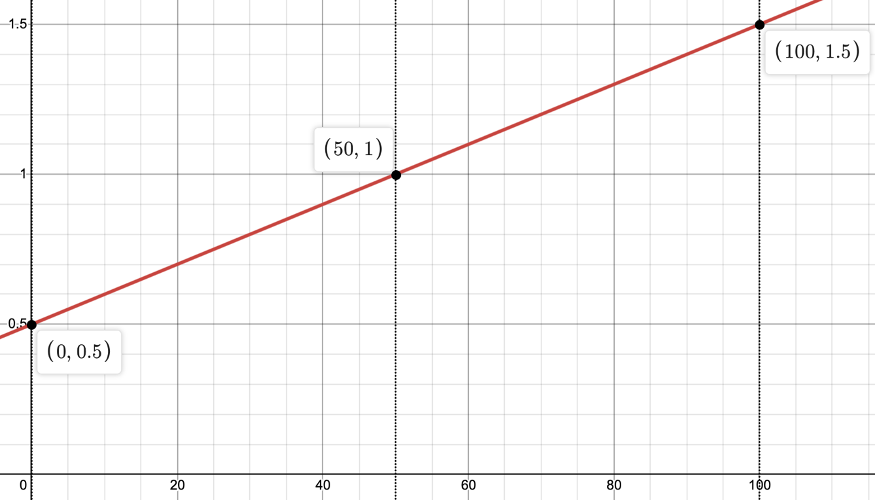
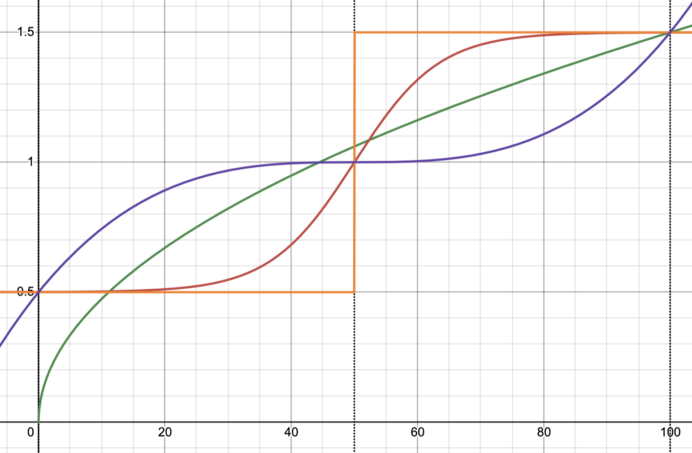

<!-- vscode-markdown-toc -->

<!-- vscode-markdown-toc-config
	numbering=false
	autoSave=true
	/vscode-markdown-toc-config -->
<!-- /vscode-markdown-toc -->

# Career Recommendation Algorithm

- [Career Recommendation Algorithm](#markdown-header-career-recommendation-algorithm)
  - [Matched Weights](#markdown-header-matched-weights)
    - [Limitations and Alternate Solutions](#markdown-header-limitations-and-alternate-solutions)
    - [Technical Notes](#markdown-header-technical-notes)
  - [Career Rarity](#markdown-header-career-rarity)
    - [Discussion](#markdown-header-discussion)
  - [Growth Multiplier](#markdown-header-growth-multiplier)
    - [Limitations and Discussion](#markdown-header-limitations-and-discussion)
  - [Shortage Multiplier](#markdown-header-shortage-multiplier)
  - [Randomness Multiplier](#markdown-header-randomness-multiplier)

In broad strokes, the career recommendation works by designating a weight for
each career based on its applicability to the FOE in question and other factors
such as salary, projected job growth, and future demand for the job. The
calculation of the weighting follows the following
[formula](https://bitbucket.org/comp3888_th08_01/oic-analysis/src/831d54221dd267c13d1718db63125f286b6811a0/application/career_rec/display_careers.py#application/career_rec/display_careers.py-34:35):

$$
\dfrac{\sum(\text{Matched Weights})}{\text{Career Rarity}} \times \text{Growth Multiplier} \times \text{Shortage Multiplier} \times \text{Randomness}
$$

## Matched Weights

Matched Weights refers to how strongly a degree requirement is related to a
particular career. This is calculated by
[extracting keywords](https://bitbucket.org/comp3888_th08_01/oic-analysis/src/123e6bd80b9a1f863af51fd1e950396db5b811ee/scripts/job_degree_scrapers/requirements/clean_degrees.py#scripts/job_degree_scrapers/requirements/clean_degrees.py-87)
that relate to particular FOEs (through the degree names connected with an FOE).
The more
[frequently](https://bitbucket.org/comp3888_th08_01/oic-analysis/src/123e6bd80b9a1f863af51fd1e950396db5b811ee/scripts/job_degree_scrapers/requirements/clean_degrees.py#scripts/job_degree_scrapers/requirements/clean_degrees.py-30)
a keyword is present in degrees name for an FOE, the more closely they are
considered linked.

Each career is potentially matched to multiple FOEs, with each mapping having
its own value for `matched_weights`. In the algorithm, all existing entries
mapping a career to a particular FOE are aggregated as a sum.

### Limitations and Alternate Solutions

A major limitation of the above is that it penalizes keywords that are uncommon,
but potentially extremely representative of a Field of Education. Meanwhile
common degrees like “Bachelor of Science” are prioritized. For instance,
“Astrophysics”, which is highly tied to FOE 0103 (Physics and Astronomy) occurs
exactly once as a keyword for bachelor’s degrees. This limitation is somewhat
mitigated by the career rarity factor.

That said, this ultimately was chosen as the preferred solution. Alternatives
included

- **Using large language models (LLM) to match FOEs to careers:** This does help
  with using more intuitive heuristics as it is based on language models, but it
  runs into the same issue as above. The more uncommon some text is, the less
  predictable the results from LLMs. Further, the non-deterministic nature of
  LLMs means that it is hard to reproduce and verify any results.
- **Weighting similarities as a flat rate**—if the keyword matches the career at
  all, then it is considered a good representation. This helps eliminate the
  issues of penalizing uncommon degrees/careers, but due to the “dirtiness” of
  the data we have access to, is not a robust option. Our data, being scraped
  from online sources, has a very high degree of noise. Allowing each match to
  be considered equally runs a high risk of accepting noise as real data. The
  solution that is accepted guards against noise much better by averaging out
  the collected data.
- **Manually connecting careers to FOEs**: This is the most labour intensive
  option, even when additional GUIs are added to support it. It relies on
  heuristics of the individual marker in order to draw connection in data.
  Therefore, it is not suitable for scaling up in the long term because of the
  risk of additional human biases and mistakes made from tedium. Even so, this
  method was employed in small doses to fill in missing data for career
  information taken from other sources (like Seek or the ABS).

### Technical Notes

The matched weights are precalculated for each career-FOE pair through the
script, `scripts.job_degree_scrapers.requirements.clean_degrees`.

## Career Rarity

This part of the algorithm adjusts for overpredictions of certain careers. The
career_rarity is implemented as a
[count of the total occurrences](https://bitbucket.org/comp3888_th08_01/oic-analysis/src/831d54221dd267c13d1718db63125f286b6811a0/application/career_rec/display_careers.py#application/career_rec/display_careers.py-69:75)
of a particular career in the `degree_requirements` table. This indicates how
common the career is across multiple FOEs and thus is a reasonably good
indicator for careers that may be overrepresented. The more overrepresented a
career is, the more it is penalized by this factor

Adjustments can be made to this divisor should the need arise. Rather than an
aggregate over all FOE and career pair, it could be limited to just the FOE that
is being requested, which would less severely penalize careers that are common
in general but not necessarily for an FOE prediction.

Additionally, the total number is currently used as a divisor. This is fine
because the number is guaranteed to be greater than 0. However, a Laplace
corrector can be used if necessary.

### Discussion

Some careers are overpredicted in our implementation. This is due to a
combination of factors:

1. Some careers are more common than others. A typical person is more likely to
   encounter a Line Cook than an Anesthesiologist.
2. Our database, in particular, is saturated with entry level jobs as these are
   the ones most likely to be advertised on sites like Indeed and Workforce
   Australia. The inherent sample bias of these sites results in overpredictions
   for careers like Tutor or Teacher.

The second reason is an issue with the quality of data. Given the scope and
timeframe of the project those data sources were suitable as they were easy to
access, relevant, and varied. However, for future development, we recommend that
OIC Education consider commercial sources of this information. Web-scraped data
is far less reliable than commercial sources as commercial sources are more
rigorously cleaned and checked.

## Growth Multiplier

The growth multiplier rewards career paths that have strong predicted growth
(per ABS) for 2033 and penalizes those with weak or negative growth.

In detail, the multiplier is
[calculated](https://bitbucket.org/comp3888_th08_01/oic-analysis/src/831d54221dd267c13d1718db63125f286b6811a0/application/career_rec/display_careers.py#application/career_rec/display_careers.py-58:59)
by ranking all careers that we have data on (i.e. entries in the `growth_data`
table) based on the percentage growth for 2033 in ascending order. If a career
is not present in this table, then the multiplier is neutral (1) and the
weighting is not affected. The ranking of all of the careers (from 1 to the
total number of rows) is normalized to a value between 0 and 1. We add 0.5 to
the normalized ranking to calculate the multiplier.

In effect, the bottom fifty percent of careers in terms of growth are scaled
down by a multiplier between 0.5 and 1. The top 50% of careers are weighted
higher by a factor between 1 and 1.5.

### Limitations and Discussion

Note that a career’s true growth value is not used—it is just the relative
ranking of careers. This was done to limit the effect of overall economic growth
on the multiplier. If, for instance, employment was projected to grow across the
board, then using that projected growth itself would skew all results
positively. The current implementation mitigates this concern. However, in doing
so, it does obfuscate some of the details in the data. For example, if there are
stand-out industries that are growing at an extremely fast pace, our
implementation does not capture that.

Moreover, the growth that we use is relative to industry size. This means that
our algorithm will prefer careers in smaller industries with high growth over
those in large industries with lower growth. This is intentional in our current
design to highlight careers that students may not have encountered before.
However, we acknowledge that this may not be the desired behavior in the future.

Additionally, we use 2033 projected growth for this calculation. This does give
a better indication of career outcomes by the time a highschooler is likely to
graduate university. However, because it is a projection further into the
future, it is likely to be more inaccurate.

Another point to consider is that we have picked two fairly arbitrary values as
the minimum and maximum multiplier (0.5 and 1.5 respectively). These can be
adjusted as needed into the future as more data and quality indicators are
collected over time.

Finally, we note that we have modelled this multiplier as a linear relationship
(as pictured below, where the x-axis is the percentile, and the y-axis is the
modifier value). This is the simplest relationship that captures the relative
preference of high growth careers over low growth ones.

Other relationship may be considered, depending on evolving needs. Some examples
are shown below:

- Heavily penalize careers with very low growth, but do not penalize slow/steady
  growth too much: $1.5\times\sqrt{\frac{x}{100}}$ (_green_)
- Heavy penalize any careers below 50th percentile and heavy reward careers
  above 50th percentile $\frac{1}{1+e^{-0.15\left(x-50\right)}}+0.5$ (_red_) or
  even $\frac{1}{1+e^{-1000\left(x-50\right)}}+0.5$ (_orange_) for a more
  extreme version
- Even out the careers with growth near the 50th percentile, but exaggerate
  growth elsewhere: $4\left(\frac{x-50}{100}\right)^{3}+1$ (_purple_)

## Shortage Multiplier

The shortage multiplier is based on whether or not a particular industry is
projected to have a future skills shortage in Australia (as reported by the
ABS).

Careers with shortages have a 1.5 times multiplier to their weight. Careers with
regional shortages have a 1.25 multiplier. Careers with no shortage or no data
have a 1 times multiplier. These may be updated as needed in the
[SQLite query](https://bitbucket.org/comp3888_th08_01/oic-analysis/src/831d54221dd267c13d1718db63125f286b6811a0/application/career_rec/display_careers.py#application/career_rec/display_careers.py-53:57)

## Randomness Multiplier

This multiplier is used to inject randomness into the results returned. This may
be useful if the user is looking to explore careers that they have not seen
before.
